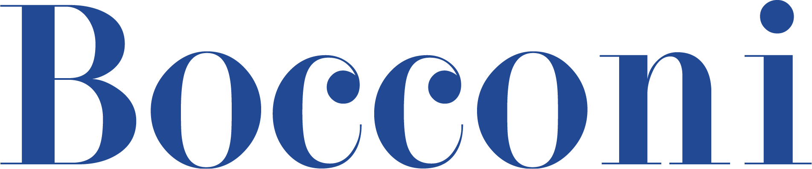
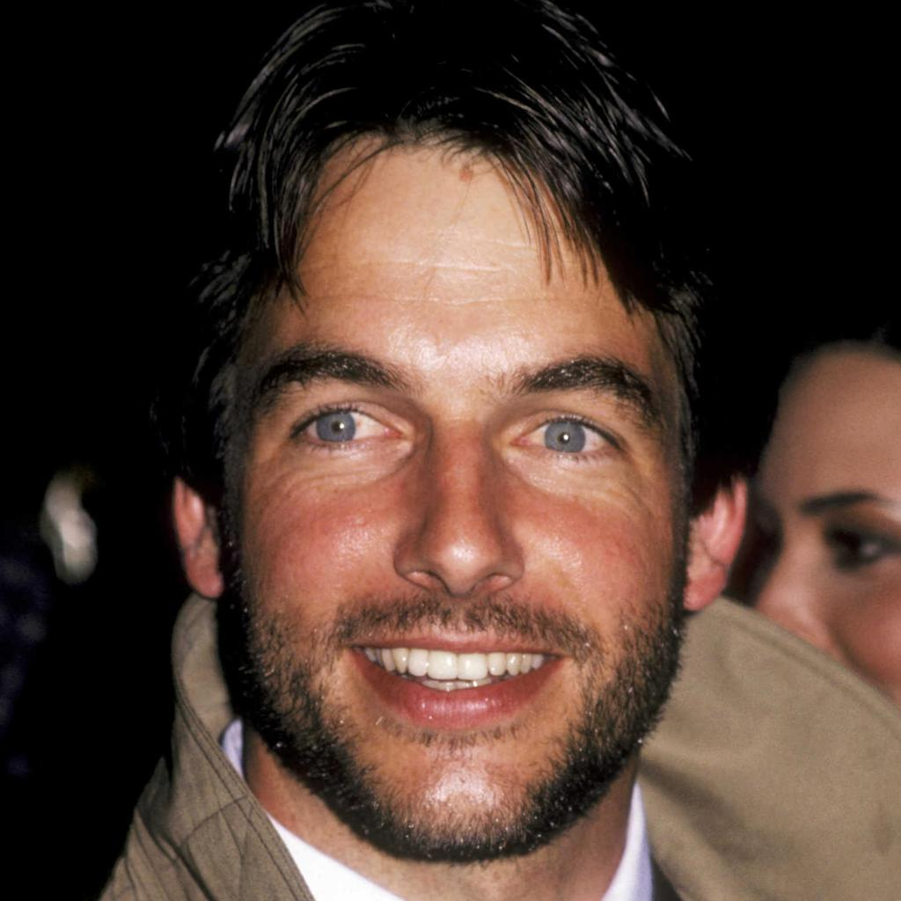
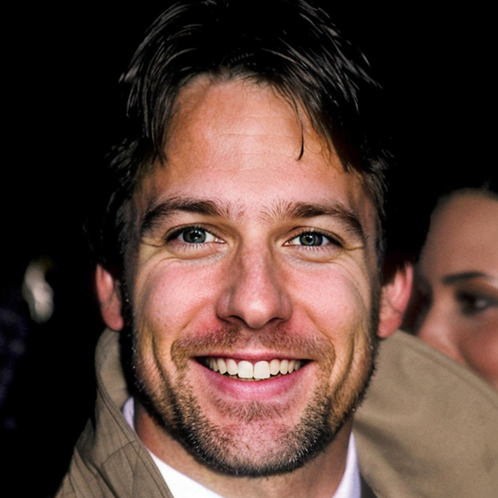
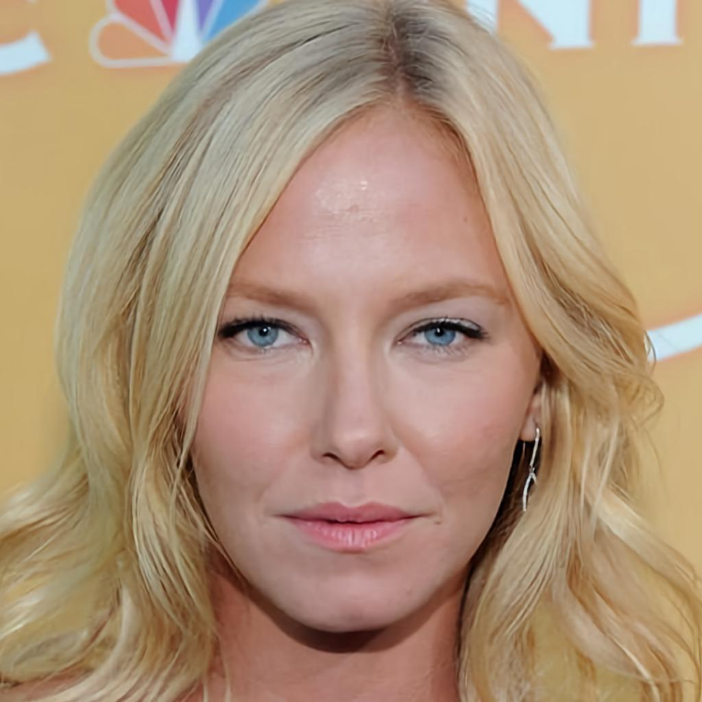
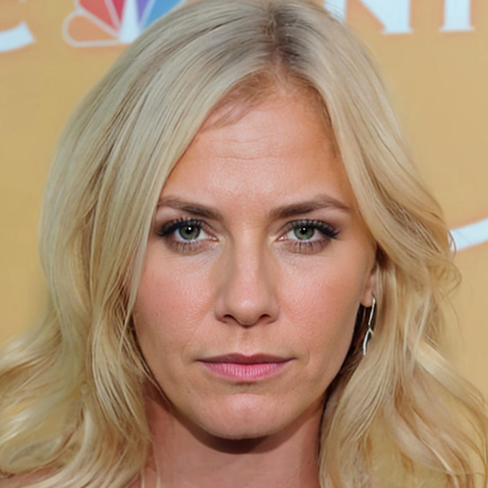
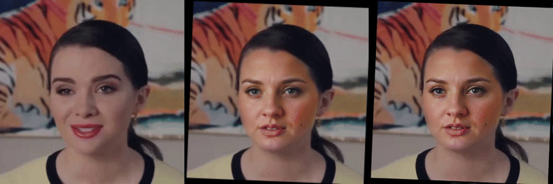

<h1 align="center">AnonNET: A Unified Framework for Expression-Consistent Anonymization in Talking Head Videos</h1>

<p align="center">
    <a href='LICENSE'></a> 
    <a href=''></a>
    <a href='https://anilegin.github.io/AnonNET-project/'></a>
    <!--<a href='https://huggingface.co/spaces/anilegin/AnonNET'></a>-->
    <a href="https://github.com/anilegin/AnonNET"></a>
<br>

</p>

<p align="center">
  <a href="https://anilegin.com" target="_blank">Anil Egin</a><sup>1,2</sup>, 
  <a href="https://www.andreatangherloni.com" target="_blank">Andrea Tangherloni</a><sup>2</sup>, 
  <a href="https://www-sop.inria.fr/members/Antitza.Dantcheva/" target="_blank">Antitza Dantcheva</a><sup>1</sup>
  <br>
  <sup>1</sup>Inria Méditerranée, <sup>2</sup>Bocconi University
</p>

<p align="center">
  
  
</p>


**AnonNET** is a multi-stage face anonymization pipeline designed to preserve non-identifying facial attributes (e.g., age, gender, race, and expression) while ensuring robust identity obfuscation in both images and talking-head videos. It combines attribute-conditioned diffusion-based inpainting with landmark-free motion synthesis, making it suitable for real-world and privacy-critical video anonymization applications.

This repository provides the implementation of AnonNET as described in our paper:

📄 **Now You See Me, Now You Don’t: A Unified Framework for Expression-Consistent Anonymization in Talking Head Videos**  
🗣️ Oral Presentation at the IEEE International Conference on Computer Vision (ICCV) 2025, Workshop on Computer Vision for Biometrics, Identity & Behaviour (CV4BIOM), Hawaii, USA.
 
---

## Key Features

- **Attribute-aware anonymization**  
  Guided by facial attribute recognition (age, gender, race, expression)

- **Diffusion-based inpainting**  
  Utilizes Stable Diffusion v1.5 with ControlNet conditioning (e.g., face parsing masks)

- **Motion synthesis**  
  Landmark-free reenactment using LIA or LivePortrait

---

## Anonymization Samples

### 🖼️ Image Anonymization

Here are examples of AnonNET’s image anonymization (Original → Anonymized):

<p align="center">
  
  
</p>

<p align="center">
  
  
</p>

### 🎥 Video Anonymization

Here are video anonymization examples (Original → Anonymized):

<div align="center">
  <h3>Sample 1: Original → Source → Anonymized</h3>
  
</div>

<div align="center">
  <h3>Sample 2: Original → Source → Anonymized</h3>
  
</div>


---

## 🛠 Installation

> Requires: **Python 3.9** and **CUDA >= 12.1** (GPU required for inpainting and motion synthesis)


```bash
git clone https://github.com/anilegin/AnonNET.git
cd AnonNET
python3.9 -m venv AnonNET
source AnonNET/bin/activate  # On Windows use: AnonNET\Scripts\activate
pip install -r requirements.txt
```

---

## Extra Dependencies

Manually download or cache models for:

`vox.pt` – Required for LIA motion synthesis  
  Download from the [Releases](https://github.com/anilegin/AnonNET/releases/download/v1.0.0/vox.pt) page and place under `Generation/pretrained_weights`.

Other model weights (Stable Diffusion, RetinaFace, etc.) are expected to be downloaded and stored automatically when the script is initalized.

---

## 📸 Image Anonymization

```bash
python image_anonymize.py \
    --image path/to/input.jpg \
    --segment face \
    --prompt "A photorealistic portrait of a middle-aged Asian woman with a neutral expression" \
    --strength 0.9 0.4 0.3 \
    --save_folder results/
```

### Parameters

| Argument        | Description                                               |
|----------------|-----------------------------------------------------------|
| `--image`       | Input image path                                          |
| `--segment`     | Type of mask: `face` or `head`                            |
| `--prompt`      | (Optional) Otherwise attribute-aware one will be generated|
| `--strength`    | Mask, lineart, and openpose guidance strengths            |
| `--steps`       | Denosing steps                                            |
| `--seed`        | Random seed (optional)                                    |
| `--save_folder` | Output folder for anonymized image                        |

---

## 🎬 Video Anonymization

```bash
python anonymize.py \
    --driving_path path/to/video.mp4 \
    --motion lp \
    --segment face \
    --save_folder results/
```

### Parameters

| Argument           | Description                                           |
|-------------------|-------------------------------------------------------|
| `--driving_path`   | Path to input video                                   |
| `--motion`         | `lp` for LivePortrait, `lia` for Latent Image Animator|
| `--segment`        | `face` or `head` segmentation                         |
| `--max_len`        | Max clip length (optional)                            |
| `--save_folder`    | Output folder                                         |
| `--no_stitch`      | No eye-lip retargeting for LivePortrait               |

---
##  Contact

For questions or feedback, please contact: [anilegin@gmail.com](mailto:anilegin@gmail.com)

## 📃 License

This repository is released under the MIT License.

The code of InsightFace is released under the MIT License.
The models of InsightFace are for non-commercial research purposes only.

If you want to use the AnonNET project for commercial purposes, you 
should remove and replace InsightFace’s detection models to fully comply with 
the MIT license.
